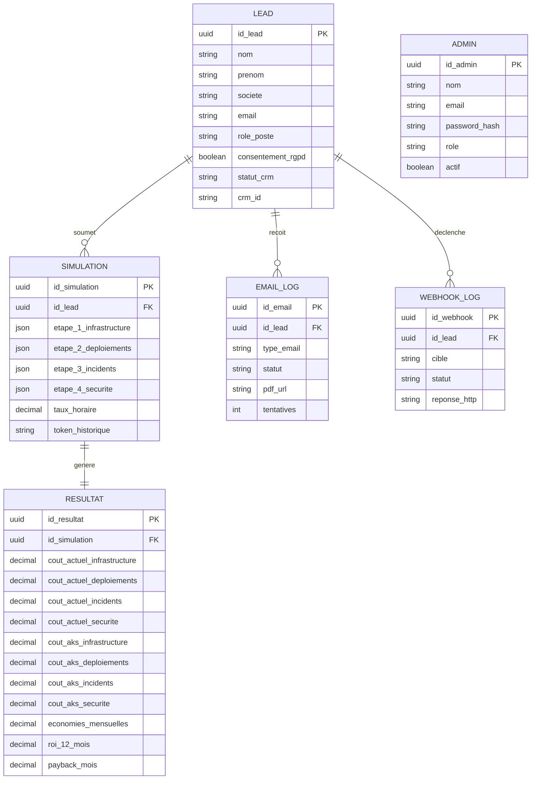

# Modelisation des donnees - version cible demandee

Ce document reprend strictement les entites demandees:
- LEAD
- SIMULATION
- RESULTAT
- EMAIL_LOG
- WEBHOOK_LOG
- ADMIN

Hypothese technique: PostgreSQL 15+.

## 1) Entites et associations (MCD)

### Tableau de reference

| Entite | Role | Attributs principaux |
|---|---|---|
| LEAD | Prospect ayant soumis le formulaire | id_lead, nom, prenom, societe, email, role_poste, consentement_rgpd, statut_crm, crm_id |
| SIMULATION | Reponses du wizard (4 etapes) | id_simulation, id_lead (FK), donnees etapes 1-4, taux_horaire, token_historique |
| RESULTAT | Resultats calcules par l'Azure Function | id_resultat, id_simulation (FK), couts par axe, economies, roi_12_mois, payback_mois |
| EMAIL_LOG | Tracabilite des envois de rapports PDF | id_email, id_lead (FK), type_email, statut, pdf_url, tentatives |
| WEBHOOK_LOG | Tracabilite des appels CRM (HubSpot/Airtable) | id_webhook, id_lead (FK), cible, statut, reponse_http |
| ADMIN | Compte administrateur du dashboard | id_admin, nom, email, password_hash, role, actif |

### Cardinalites
- Un LEAD peut avoir 0..n SIMULATION.
- Une SIMULATION appartient a 1 LEAD.
- Une SIMULATION produit 1 RESULTAT (dans ce modele cible).
- Un LEAD peut avoir 0..n EMAIL_LOG.
- Un LEAD peut avoir 0..n WEBHOOK_LOG.
- ADMIN est independant fonctionnellement (pas de FK obligatoire).

### Diagramme MCD (Mermaid)



## 2) MLD (Modele Logique de Donnees)

### LEAD
- id_lead (PK, UUID)
- nom (VARCHAR(120), NOT NULL)
- prenom (VARCHAR(120), NOT NULL)
- societe (VARCHAR(180), NOT NULL)
- email (VARCHAR(255), NOT NULL, UNIQUE)
- role_poste (VARCHAR(120), NOT NULL)
- consentement_rgpd (BOOLEAN, NOT NULL)
- statut_crm (VARCHAR(30), NOT NULL, default 'a_traiter')
- crm_id (VARCHAR(255), NULL)
- created_at (TIMESTAMPTZ, NOT NULL)
- updated_at (TIMESTAMPTZ, NOT NULL)

### SIMULATION
- id_simulation (PK, UUID)
- id_lead (FK -> LEAD.id_lead, NOT NULL)
- etape_1_infrastructure (JSONB, NOT NULL)
- etape_2_deploiements (JSONB, NOT NULL)
- etape_3_incidents (JSONB, NOT NULL)
- etape_4_securite (JSONB, NOT NULL)
- taux_horaire (NUMERIC(10,2), NOT NULL)
- token_historique (VARCHAR(255), NULL)
- created_at (TIMESTAMPTZ, NOT NULL)

### RESULTAT
- id_resultat (PK, UUID)
- id_simulation (FK -> SIMULATION.id_simulation, NOT NULL, UNIQUE)
- cout_actuel_infrastructure (NUMERIC(14,2), NOT NULL)
- cout_actuel_deploiements (NUMERIC(14,2), NOT NULL)
- cout_actuel_incidents (NUMERIC(14,2), NOT NULL)
- cout_actuel_securite (NUMERIC(14,2), NOT NULL)
- cout_aks_infrastructure (NUMERIC(14,2), NOT NULL)
- cout_aks_deploiements (NUMERIC(14,2), NOT NULL)
- cout_aks_incidents (NUMERIC(14,2), NOT NULL)
- cout_aks_securite (NUMERIC(14,2), NOT NULL)
- economies_mensuelles (NUMERIC(14,2), NOT NULL)
- roi_12_mois (NUMERIC(8,2), NOT NULL)
- payback_mois (NUMERIC(8,2), NOT NULL)
- created_at (TIMESTAMPTZ, NOT NULL)

### EMAIL_LOG
- id_email (PK, UUID)
- id_lead (FK -> LEAD.id_lead, NOT NULL)
- type_email (VARCHAR(40), NOT NULL)
- statut (VARCHAR(30), NOT NULL)
- pdf_url (TEXT, NULL)
- tentatives (INT, NOT NULL, default 0)
- created_at (TIMESTAMPTZ, NOT NULL)

### WEBHOOK_LOG
- id_webhook (PK, UUID)
- id_lead (FK -> LEAD.id_lead, NOT NULL)
- cible (VARCHAR(40), NOT NULL)
- statut (VARCHAR(30), NOT NULL)
- reponse_http (TEXT, NULL)
- created_at (TIMESTAMPTZ, NOT NULL)

### ADMIN
- id_admin (PK, UUID)
- nom (VARCHAR(120), NOT NULL)
- email (VARCHAR(255), NOT NULL, UNIQUE)
- password_hash (VARCHAR(255), NOT NULL)
- role (VARCHAR(40), NOT NULL)
- actif (BOOLEAN, NOT NULL, default true)
- created_at (TIMESTAMPTZ, NOT NULL)
- updated_at (TIMESTAMPTZ, NOT NULL)

## 3) BDD - DDL SQL (PostgreSQL)

```sql
CREATE EXTENSION IF NOT EXISTS pgcrypto;

CREATE TABLE lead (
  id_lead UUID PRIMARY KEY DEFAULT gen_random_uuid(),
  nom VARCHAR(120) NOT NULL,
  prenom VARCHAR(120) NOT NULL,
  societe VARCHAR(180) NOT NULL,
  email VARCHAR(255) NOT NULL UNIQUE,
  role_poste VARCHAR(120) NOT NULL,
  consentement_rgpd BOOLEAN NOT NULL,
  statut_crm VARCHAR(30) NOT NULL DEFAULT 'a_traiter',
  crm_id VARCHAR(255),
  created_at TIMESTAMPTZ NOT NULL DEFAULT NOW(),
  updated_at TIMESTAMPTZ NOT NULL DEFAULT NOW()
);

CREATE TABLE simulation (
  id_simulation UUID PRIMARY KEY DEFAULT gen_random_uuid(),
  id_lead UUID NOT NULL REFERENCES lead(id_lead) ON DELETE CASCADE,
  etape_1_infrastructure JSONB NOT NULL,
  etape_2_deploiements JSONB NOT NULL,
  etape_3_incidents JSONB NOT NULL,
  etape_4_securite JSONB NOT NULL,
  taux_horaire NUMERIC(10,2) NOT NULL,
  token_historique VARCHAR(255),
  created_at TIMESTAMPTZ NOT NULL DEFAULT NOW()
);

CREATE TABLE resultat (
  id_resultat UUID PRIMARY KEY DEFAULT gen_random_uuid(),
  id_simulation UUID NOT NULL UNIQUE REFERENCES simulation(id_simulation) ON DELETE CASCADE,
  cout_actuel_infrastructure NUMERIC(14,2) NOT NULL,
  cout_actuel_deploiements NUMERIC(14,2) NOT NULL,
  cout_actuel_incidents NUMERIC(14,2) NOT NULL,
  cout_actuel_securite NUMERIC(14,2) NOT NULL,
  cout_aks_infrastructure NUMERIC(14,2) NOT NULL,
  cout_aks_deploiements NUMERIC(14,2) NOT NULL,
  cout_aks_incidents NUMERIC(14,2) NOT NULL,
  cout_aks_securite NUMERIC(14,2) NOT NULL,
  economies_mensuelles NUMERIC(14,2) NOT NULL,
  roi_12_mois NUMERIC(8,2) NOT NULL,
  payback_mois NUMERIC(8,2) NOT NULL,
  created_at TIMESTAMPTZ NOT NULL DEFAULT NOW()
);

CREATE TABLE email_log (
  id_email UUID PRIMARY KEY DEFAULT gen_random_uuid(),
  id_lead UUID NOT NULL REFERENCES lead(id_lead) ON DELETE CASCADE,
  type_email VARCHAR(40) NOT NULL,
  statut VARCHAR(30) NOT NULL CHECK (statut IN ('en_attente', 'envoye', 'erreur')),
  pdf_url TEXT,
  tentatives INT NOT NULL DEFAULT 0 CHECK (tentatives >= 0),
  created_at TIMESTAMPTZ NOT NULL DEFAULT NOW()
);

CREATE TABLE webhook_log (
  id_webhook UUID PRIMARY KEY DEFAULT gen_random_uuid(),
  id_lead UUID NOT NULL REFERENCES lead(id_lead) ON DELETE CASCADE,
  cible VARCHAR(40) NOT NULL CHECK (cible IN ('hubspot', 'airtable', 'salesforce', 'autre')),
  statut VARCHAR(30) NOT NULL CHECK (statut IN ('succes', 'erreur', 'timeout')),
  reponse_http TEXT,
  created_at TIMESTAMPTZ NOT NULL DEFAULT NOW()
);

CREATE TABLE admin (
  id_admin UUID PRIMARY KEY DEFAULT gen_random_uuid(),
  nom VARCHAR(120) NOT NULL,
  email VARCHAR(255) NOT NULL UNIQUE,
  password_hash VARCHAR(255) NOT NULL,
  role VARCHAR(40) NOT NULL,
  actif BOOLEAN NOT NULL DEFAULT TRUE,
  created_at TIMESTAMPTZ NOT NULL DEFAULT NOW(),
  updated_at TIMESTAMPTZ NOT NULL DEFAULT NOW()
);

CREATE INDEX idx_simulation_id_lead ON simulation(id_lead);
CREATE INDEX idx_resultat_id_simulation ON resultat(id_simulation);
CREATE INDEX idx_email_log_id_lead ON email_log(id_lead);
CREATE INDEX idx_webhook_log_id_lead ON webhook_log(id_lead);
CREATE INDEX idx_lead_email ON lead(email);
```

## 4) Dictionnaire de donnees

### LEAD
| Champ | Type | Null | Regle | Description |
|---|---|---|---|---|
| id_lead | UUID | Non | PK | Identifiant du prospect |
| nom | VARCHAR(120) | Non | 1..120 caracteres | Nom |
| prenom | VARCHAR(120) | Non | 1..120 caracteres | Prenom |
| societe | VARCHAR(180) | Non | 1..180 caracteres | Societe |
| email | VARCHAR(255) | Non | Unique + format email | Email professionnel |
| role_poste | VARCHAR(120) | Non | Valeur metier | Role du contact |
| consentement_rgpd | BOOLEAN | Non | true requis | Consentement legal |
| statut_crm | VARCHAR(30) | Non | a_traiter/synchronise/erreur | Statut integration CRM |
| crm_id | VARCHAR(255) | Oui | ID externe | Identifiant CRM |

### SIMULATION
| Champ | Type | Null | Regle | Description |
|---|---|---|---|---|
| id_simulation | UUID | Non | PK | Identifiant simulation |
| id_lead | UUID | Non | FK -> LEAD | Proprietaire |
| etape_1_infrastructure | JSONB | Non | Objet JSON valide | Reponses etape 1 |
| etape_2_deploiements | JSONB | Non | Objet JSON valide | Reponses etape 2 |
| etape_3_incidents | JSONB | Non | Objet JSON valide | Reponses etape 3 |
| etape_4_securite | JSONB | Non | Objet JSON valide | Reponses etape 4 |
| taux_horaire | NUMERIC(10,2) | Non | >= 0 | Taux horaire applique |
| token_historique | VARCHAR(255) | Oui | Token unique possible | Cle de suivi/historique |

### RESULTAT
| Champ | Type | Null | Regle | Description |
|---|---|---|---|---|
| id_resultat | UUID | Non | PK | Identifiant resultat |
| id_simulation | UUID | Non | FK unique -> SIMULATION | 1 resultat par simulation |
| cout_actuel_infrastructure | NUMERIC(14,2) | Non | >= 0 | Cout actuel infra |
| cout_actuel_deploiements | NUMERIC(14,2) | Non | >= 0 | Cout actuel deploiements |
| cout_actuel_incidents | NUMERIC(14,2) | Non | >= 0 | Cout actuel incidents |
| cout_actuel_securite | NUMERIC(14,2) | Non | >= 0 | Cout actuel securite |
| cout_aks_infrastructure | NUMERIC(14,2) | Non | >= 0 | Cout cible AKS infra |
| cout_aks_deploiements | NUMERIC(14,2) | Non | >= 0 | Cout cible AKS deploiements |
| cout_aks_incidents | NUMERIC(14,2) | Non | >= 0 | Cout cible AKS incidents |
| cout_aks_securite | NUMERIC(14,2) | Non | >= 0 | Cout cible AKS securite |
| economies_mensuelles | NUMERIC(14,2) | Non | cout_actuel - cout_aks | Economies mensuelles |
| roi_12_mois | NUMERIC(8,2) | Non | Peut etre negatif | ROI sur 12 mois |
| payback_mois | NUMERIC(8,2) | Non | > 0 | Delai de retour |

### EMAIL_LOG
| Champ | Type | Null | Regle | Description |
|---|---|---|---|---|
| id_email | UUID | Non | PK | Identifiant envoi email |
| id_lead | UUID | Non | FK -> LEAD | Lead cible |
| type_email | VARCHAR(40) | Non | rapport_pdf, relance, etc. | Type d'email |
| statut | VARCHAR(30) | Non | en_attente/envoye/erreur | Etat d'envoi |
| pdf_url | TEXT | Oui | URL du fichier PDF | Lien rapport |
| tentatives | INT | Non | >= 0 | Nombre de tentatives |

### WEBHOOK_LOG
| Champ | Type | Null | Regle | Description |
|---|---|---|---|---|
| id_webhook | UUID | Non | PK | Identifiant appel webhook |
| id_lead | UUID | Non | FK -> LEAD | Lead concerne |
| cible | VARCHAR(40) | Non | hubspot/airtable/... | Systeme cible |
| statut | VARCHAR(30) | Non | succes/erreur/timeout | Resultat appel |
| reponse_http | TEXT | Oui | Payload/reponse technique | Trace HTTP |

### ADMIN
| Champ | Type | Null | Regle | Description |
|---|---|---|---|---|
| id_admin | UUID | Non | PK | Identifiant administrateur |
| nom | VARCHAR(120) | Non | 1..120 caracteres | Nom complet |
| email | VARCHAR(255) | Non | Unique + format email | Compte de connexion |
| password_hash | VARCHAR(255) | Non | Hash Argon2/bcrypt | Mot de passe chiffre |
| role | VARCHAR(40) | Non | super_admin/admin/lecteur | Niveau d'acces |
| actif | BOOLEAN | Non | true/false | Statut du compte |

## 5) Notes d'implementation
1. Garder les reponses du wizard en JSONB dans SIMULATION simplifie la V1.
2. Si analytics avancee necessaire, ajouter plus tard une table de reponses detaillees.
3. Les statuts de EMAIL_LOG et WEBHOOK_LOG doivent etre mis a jour apres chaque tentative d'appel externe.
